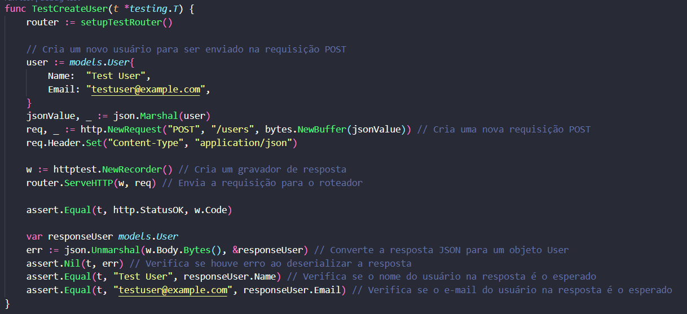
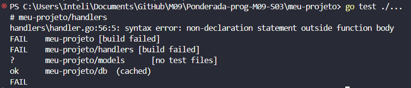
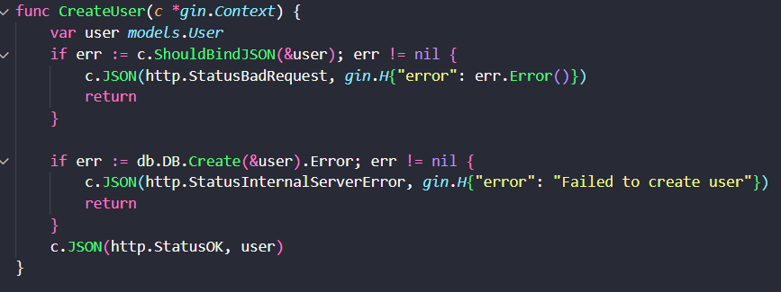
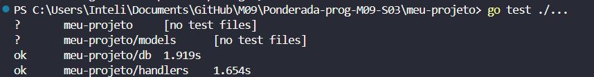

# Relatório TDD em Golang com GIN

### Introdução

Este relatório documenta o processo de desenvolvimento de um sistema utilizando a metodologia Test-Driven Development (TDD). O objetivo é demonstrar a aplicação dos princípios do TDD para garantir a qualidade e a confiabilidade das funcionalidades do sistema. A metodologia TDD é uma abordagem onde os testes são escritos antes do código de produção, garantindo que cada unidade do código atenda aos requisitos definidos e permitindo uma evolução incremental do software.

### Configuração do Ambiente
A configuração do ambiente envolveu a instalação das seguintes ferramentas e bibliotecas:

- Go: Linguagem de programação utilizada.

- Gin: Framework para construção de APIs.

- Gorm: ORM para interação com o banco de dados MySQL.

- MySQL: Sistema de gerenciamento de banco de dados.

### Metodologia TDD

A metodologia TDD é baseada em três etapas principais:

**Red:** Escrever um teste que falhe.
**Green:** Escrever o código de produção necessário para que o teste passe.
**Refactor:** Melhorar o código sem alterar seu comportamento, garantindo que todos os testes ainda passem.
Essa abordagem assegura que o desenvolvimento é guiado pelos testes e que o código atende aos requisitos especificados.

### Implementação
#### Testes

Os testes são escritos para cada funcionalidade antes de implementar a lógica correspondente. Isso garante que o código é desenvolvido com base nos requisitos e que qualquer mudança futura pode ser verificada rapidamente contra os testes existentes.

#### Exemplo:

**Etapa Red:** Escrevemos um teste que vai falhar pois não tem a função desenvolvida ainda.

TestCreateUser: Testa a criação de um usuário via API. Verifica se o usuário é criado corretamente e se a resposta da API está conforme o esperado.

Quando damos o comando do teste ele vai falhar:

**Etapa Green:** Escrevemos uma função com o mínimo para rodar o teste.

Quando damos o comando do teste ele vai passar:

**Etapa Refactor:** Com os testes passando, podemos refatorar o código se necessário. Poderíamos melhorar a configuração do banco de dados ou a estrutura dos handlers para maior clareza e manutenção. Mas no exemplo atual, o código já está relativamente simples e claro, com vários comentários.

### Conclusão
A aplicação da metodologia TDD no desenvolvimento deste sistema assegura que todas as funcionalidades foram implementadas conforme os requisitos e que a qualidade do código é mantida. A abordagem TDD facilita a identificação de problemas rapidamente e proporciona uma base sólida para futuras modificações e melhorias.

#### Benefícios da Metodologia TDD

**Qualidade do Código:** A prática de escrever testes antes do código de produção garante que cada parte do software seja testada e verificada desde o início. Isso reduz a probabilidade de bugs e problemas inesperados no futuro.

**Confiança em Alterações:** Com uma suite abrangente de testes automatizados, as alterações no código podem ser feitas com confiança, sabendo que os testes validarão se a funcionalidade existente ainda está funcionando como esperado.

**Facilidade de Refatoração:** Com a cobertura de testes abrangente, o código pode ser refatorado e melhorado continuamente sem medo de quebrar funcionalidades existentes. Isso promove um ciclo de desenvolvimento iterativo e incremental.